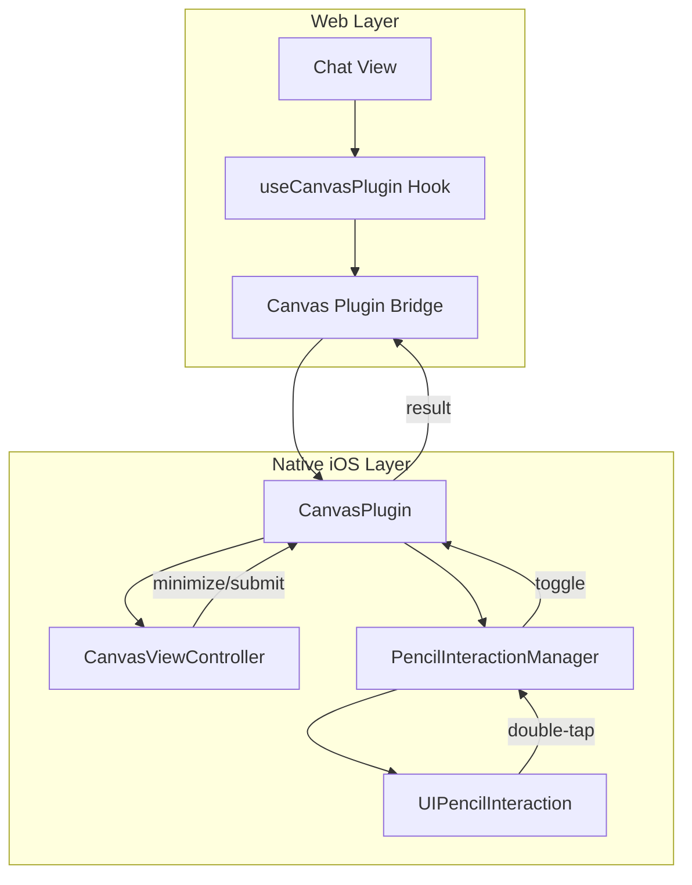

# Design Document: Apple Pencil Double-Tap Canvas Toggle

## Overview

This feature adds Apple Pencil double-tap gesture support to toggle the canvas overlay open/closed. The implementation uses the native `UIPencilInteraction` API available on iPadOS 12.1+ for Apple Pencil (2nd generation) and Apple Pencil Pro devices.

The gesture provides a hardware shortcut that complements the existing on-screen toggle button, allowing users to quickly switch between drawing and viewing their chat without lifting their pencil to tap UI elements.

## Architecture



The architecture introduces a new `PencilInteractionManager` class that:
1. Manages `UIPencilInteraction` registration on the main web view
2. Listens for double-tap gestures via `UIPencilInteractionDelegate`
3. Communicates with `CanvasPlugin` to trigger canvas open/minimize actions

## Components and Interfaces

### PencilInteractionManager (New)

A singleton class that manages Apple Pencil interaction across the app lifecycle.

```swift
protocol PencilInteractionManagerDelegate: AnyObject {
    func pencilInteractionDidRequestToggle()
}

class PencilInteractionManager: NSObject, UIPencilInteractionDelegate {
    static let shared = PencilInteractionManager()
    weak var delegate: PencilInteractionManagerDelegate?
    private var interaction: UIPencilInteraction?
    
    func setupInteraction(on view: UIView) {
        let pencilInteraction = UIPencilInteraction()
        pencilInteraction.delegate = self
        view.addInteraction(pencilInteraction)
        self.interaction = pencilInteraction
    }
    
    func pencilInteractionDidTap(_ interaction: UIPencilInteraction) {
        // Always toggle canvas regardless of preferredTapAction
        // since our toggle action is app-specific, not tool-switching
        delegate?.pencilInteractionDidRequestToggle()
    }
}
```

### CanvasPlugin (Modified)

The existing plugin is extended to:
1. Implement `PencilInteractionManagerDelegate`
2. Handle toggle requests from the pencil interaction
3. Track canvas open/closed state internally

```swift
extension CanvasPlugin: PencilInteractionManagerDelegate {
    func pencilInteractionDidRequestToggle() {
        if isCanvasOpen {
            minimizeCanvas()
        } else {
            openCanvasFromPencilTap()
        }
    }
}
```

### CanvasViewController (Modified)

The canvas view controller is extended to:
1. Register its own `UIPencilInteraction` when presented
2. Handle double-tap to minimize while drawing

## Data Models

No new data models are required. The existing `CanvasResult` interface handles all communication:

```typescript
interface CanvasResult {
  action: 'submitted' | 'minimized' | 'cancelled';
  imageData?: string;
  hasContent: boolean;
}
```

## Correctness Properties

*A property is a characteristic or behavior that should hold true across all valid executions of a system-essentially, a formal statement about what the system should do. Properties serve as the bridge between human-readable specifications and machine-verifiable correctness guarantees.*

### Property 1: Double-tap toggles canvas state
*For any* canvas state (open or closed), when a double-tap gesture is detected, the canvas state SHALL transition to the opposite state (closed becomes open, open becomes closed/minimized).
**Validates: Requirements 1.1, 2.1**

### Property 2: State preservation round-trip
*For any* drawing on the canvas, minimizing via double-tap and then reopening via double-tap SHALL restore the exact same drawing strokes.
**Validates: Requirements 1.2, 2.2**

### Property 3: Minimize notification includes content state
*For any* minimize action triggered by double-tap, the delegate callback SHALL be invoked with the correct `hasContent` boolean reflecting whether strokes exist on the canvas.
**Validates: Requirements 2.3**

## User Preference Handling

The system provides `UIPencilInteraction.preferredTapAction` which reflects the user's system-wide preference for what double-tap should do:
- `.switchEraser` - Switch to eraser tool
- `.switchPrevious` - Switch to previous tool
- `.showColorPalette` - Show color picker
- `.showInkAttributes` - Show ink settings
- `.ignore` - Do nothing

**Design Decision**: Since our app uses double-tap for canvas toggle (a unique app-specific action), we will:
1. Always handle the double-tap for canvas toggle regardless of system preference
2. This is acceptable because our action (toggle canvas) is fundamentally different from tool switching within a drawing context
3. When the canvas is open and user is actively drawing, we could optionally respect the system preference for tool switching in a future enhancement

## Error Handling

| Scenario | Handling |
|----------|----------|
| Device doesn't support UIPencilInteraction | Gracefully skip interaction setup; app functions normally via button |
| Double-tap during canvas transition | Ignore gesture if canvas is animating open/close |
| Plugin not initialized | Log warning and ignore gesture |
| UIPencilInteraction API unavailable (older iOS) | Check availability before setup; fall back to button-only |

## Testing Strategy

### Unit Tests

- Verify `PencilInteractionManager` correctly registers interaction on view
- Verify delegate callback is invoked on simulated double-tap
- Verify `CanvasPlugin` correctly tracks open/closed state

### Property-Based Tests

Property-based tests will use XCTest with custom generators for canvas states and drawings.

**Property 1 Test**: Generate random sequences of double-tap events and verify each tap toggles the state correctly.

**Property 2 Test**: Generate random `PKDrawing` objects, perform minimize/reopen cycle via double-tap simulation, and verify drawing equality.

**Property 3 Test**: Generate random canvas states (empty/with-strokes), trigger minimize, and verify delegate receives correct `hasContent` value.

### Integration Tests

- End-to-end test: Open canvas via double-tap, draw, minimize via double-tap, verify strokes preserved
- Fallback test: Verify button toggle still works when pencil interaction is unavailable
