# Design Document

## Overview

This feature optimizes canvas image exports by implementing intelligent bounding box calculation and image scaling in the native Swift layer. The optimization happens transparently during the PNG export process in `CanvasViewController.submitTapped()`, reducing token costs by 60-80% for typical handwritten content while maintaining visual quality.

The key insight is that most canvas space is empty - users typically write in a small region of the full canvas. By calculating the minimal bounding rectangle around actual ink strokes and cropping to that region (with padding), we dramatically reduce image dimensions without losing any content.

## Architecture

```mermaid
flowchart TB
    subgraph Current["Current Flow"]
        Submit1["Submit Button"] --> Export1["Export Full Canvas<br/>(e.g., 2048x2732)"]
        Export1 --> PNG1["PNG Data<br/>(~4000 patches)"]
        PNG1 --> Scale1["Scale to 1536 patches"]
        Scale1 --> Base64_1["Base64 String"]
    end
    
    subgraph Optimized["Optimized Flow"]
        Submit2["Submit Button"] --> Bounds["Calculate Bounding Box<br/>from PKDrawing strokes"]
        Bounds --> Pad["Add 32px Padding"]
        Pad --> Crop["Crop to Bounds<br/>(e.g., 800x600)"]
        Crop --> Check["Check Dimensions"]
        Check -->|"> 3200px"| Scale2["Scale to 3200x3200 max"]
        Check -->|"<= 3200px"| Export2["Export Cropped Region"]
        Scale2 --> Export2
        Export2 --> PNG2["PNG Data<br/>(~600 patches)"]
        PNG2 --> Base64_2["Base64 String"]
    end
    
    style Optimized fill:#e1f5e1
    style Current fill:#ffe1e1
```



## Components and Interfaces

### Modified CanvasViewController (Swift)

The optimization is implemented entirely within the existing `submitTapped()` method. No interface changes are required.

```swift
class CanvasViewController: UIViewController {
    
    @objc private func submitTapped() {
        guard !canvasView.drawing.strokes.isEmpty else {
            return
        }
        
        // NEW: Calculate bounding box from strokes
        let boundingBox = calculateBoundingBox(for: canvasView.drawing)
        
        // NEW: Add padding and clip to canvas bounds
        let paddedBox = boundingBox.insetBy(dx: -32, dy: -32)
            .intersection(canvasView.bounds)
        
        // NEW: Check if we need to scale down
        let finalBox = scaleIfNeeded(rect: paddedBox, maxDimension: 3200)
        
        // NEW: Export only the bounded region
        let drawingImage = canvasView.drawing.image(
            from: finalBox.original,
            scale: finalBox.scale
        )
        
        // Create image with white background (existing logic)
        let renderer = UIGraphicsImageRenderer(size: finalBox.size)
        let image = renderer.image { context in
            UIColor.white.setFill()
            context.fill(CGRect(origin: .zero, size: finalBox.size))
            drawingImage.draw(at: .zero)
        }
        
        // NEW: Log dimensions for monitoring
        logExportDimensions(
            original: canvasView.bounds.size,
            cropped: paddedBox.size,
            final: finalBox.size
        )
        
        // Convert to base64 (existing logic)
        guard let pngData = image.pngData() else {
            delegate?.canvasDidCancel()
            return
        }
        
        let base64String = "data:image/png;base64," + pngData.base64EncodedString()
        canvas.setPreservedDrawing(nil)
        
        dismiss(animated: true) {
            self.delegate?.canvasDidSubmit(imageData: base64String)
        }
    }
    
    // NEW: Helper methods
    private func calculateBoundingBox(for drawing: PKDrawing) -> CGRect
    private func scaleIfNeeded(rect: CGRect, maxDimension: CGFloat) -> (original: CGRect, scale: CGFloat, size: CGSize)
    private func logExportDimensions(original: CGSize, cropped: CGSize, final: CGSize)
}
```

### No Changes to Plugin Interface

The optimization is transparent to the JavaScript layer:

```typescript
// lib/canvas-plugin.ts - NO CHANGES REQUIRED
export interface CanvasResult {
  action: 'submitted' | 'minimized' | 'cancelled';
  imageData?: string;  // Still base64 PNG, just smaller!
  hasContent: boolean;
}
```

## Data Models

### BoundingBox Calculation

```swift
struct BoundingBox {
    var minX: CGFloat = .infinity
    var minY: CGFloat = .infinity
    var maxX: CGFloat = -.infinity
    var maxY: CGFloat = -.infinity
    
    mutating func expand(to point: CGPoint) {
        minX = min(minX, point.x)
        minY = min(minY, point.y)
        maxX = max(maxX, point.x)
        maxY = max(maxY, point.y)
    }
    
    var rect: CGRect {
        guard minX != .infinity else {
            return .zero
        }
        return CGRect(
            x: minX,
            y: minY,
            width: maxX - minX,
            height: maxY - minY
        )
    }
}
```

### Scaling Result

```swift
struct ScalingResult {
    let original: CGRect      // Original bounding box
    let scale: CGFloat        // Scale factor applied
    let size: CGSize          // Final rendered size
}
```

## Correctness Properties

*A property is a characteristic or behavior that should hold true across all valid executions of a system-essentially, a formal statement about what the system should do. Properties serve as the bridge between human-readable specifications and machine-verifiable correctness guarantees.*

### Property 1: Bounding box contains all strokes

*For any* PKDrawing with strokes, the calculated bounding box SHALL contain all points from all strokes in the drawing.

**Validates: Requirements 1.1, 1.2**

### Property 2: Padding is applied correctly

*For any* bounding box, the padded box SHALL have dimensions increased by 64 pixels (32px on each side) unless clipped by canvas bounds.

**Validates: Requirements 1.3**

### Property 3: Cropped image preserves content

*For any* canvas submission, the cropped image SHALL contain all visible ink strokes from the original drawing.

**Validates: Requirements 2.1, 2.2**

### Property 4: Dimensions respect maximum constraint

*For any* cropped image, if either dimension exceeds 3200 pixels, the final image SHALL be scaled down such that both dimensions are ≤ 3200 pixels while preserving aspect ratio.

**Validates: Requirements 3.1, 3.2**

### Property 5: Patch calculation is correct

*For any* image dimensions, the patch count SHALL equal ceil(width/32) × ceil(height/32).

**Validates: Requirements 3.3**

### Property 6: Scaling preserves aspect ratio

*For any* image that requires scaling, the ratio of width to height SHALL remain constant before and after scaling (within floating point precision).

**Validates: Requirements 3.6**

### Property 7: Logging outputs correct dimensions

*For any* canvas export, the log SHALL contain the original canvas dimensions, the cropped dimensions after bounding box calculation, and the final exported dimensions after scaling.

**Validates: Requirements 4.1, 4.2, 4.3**

### Property 8: Empty canvas prevents export

*For any* canvas with no strokes, the bounding box SHALL be empty and export SHALL be prevented.

**Validates: Requirements 1.5, 2.3**

### Property 9: Interface compatibility

*For any* canvas submission, the returned imageData SHALL still be a valid base64-encoded PNG string with the "data:image/png;base64," prefix.

**Validates: Requirements 5.3**

## Error Handling

### Bounding Box Calculation Errors

| Error Condition | Handling Strategy |
|----------------|-------------------|
| Empty drawing (no strokes) | Return zero rect, prevent export |
| Invalid stroke points | Skip invalid points, continue with valid ones |
| Bounding box calculation fails | Fall back to full canvas export |

### Image Rendering Errors

| Error Condition | Handling Strategy |
|----------------|-------------------|
| Cropped region is too small (< 32px) | Use minimum size of 64x64 pixels |
| Scale factor is invalid (≤ 0) | Use scale factor of 1.0 (no scaling) |
| PNG data generation fails | Return error via delegate, show user message |
| Memory pressure during render | Reduce scale factor by 50%, retry once |

### Logging Errors

| Error Condition | Handling Strategy |
|----------------|-------------------|
| Logging fails | Silently continue, don't block export |
| Invalid dimensions | Log "invalid" for that dimension |

## Testing Strategy

### Property-Based Testing Library

This project will use **XCTest** with custom property-based testing helpers for Swift.

```swift
// Create a simple property testing framework
func assertProperty<T>(
    _ generator: () -> T,
    iterations: Int = 100,
    _ property: (T) -> Bool
) {
    for _ in 0..<iterations {
        let value = generator()
        XCTAssertTrue(property(value), "Property failed for value: \(value)")
    }
}
```

### Property-Based Tests

Each correctness property will be implemented as a property-based test:

```swift
// **Feature: canvas-image-optimization, Property 1: Bounding box contains all strokes**
// **Validates: Requirements 1.1, 1.2**
func testBoundingBoxContainsAllStrokes() {
    assertProperty(generateRandomDrawing, iterations: 100) { drawing in
        let bbox = calculateBoundingBox(for: drawing)
        return drawing.strokes.allSatisfy { stroke in
            stroke.path.allSatisfy { point in
                bbox.contains(point.location)
            }
        }
    }
}

// **Feature: canvas-image-optimization, Property 4: Dimensions respect maximum constraint**
// **Validates: Requirements 3.1, 3.2**
func testDimensionsRespectMaximum() {
    assertProperty(generateRandomRect, iterations: 100) { rect in
        let result = scaleIfNeeded(rect: rect, maxDimension: 3200)
        return result.size.width <= 3200 && result.size.height <= 3200
    }
}

// **Feature: canvas-image-optimization, Property 6: Scaling preserves aspect ratio**
// **Validates: Requirements 3.6**
func testScalingPreservesAspectRatio() {
    assertProperty(generateRandomRect, iterations: 100) { rect in
        let result = scaleIfNeeded(rect: rect, maxDimension: 3200)
        let originalRatio = rect.width / rect.height
        let finalRatio = result.size.width / result.size.height
        return abs(originalRatio - finalRatio) < 0.001 // Floating point tolerance
    }
}
```

### Unit Tests

Unit tests will cover:
- Bounding box calculation with various stroke patterns
- Padding application and clipping
- Scaling logic for different dimension combinations
- Edge cases (empty canvas, single point, very large canvas)
- Logging output format

### Integration Tests

Integration tests will verify:
- Full export flow with real PKDrawing objects
- Image quality after cropping and scaling
- Base64 encoding correctness
- Compatibility with existing JavaScript layer

### Test File Organization

```
ios/App/AppTests/
├── CanvasOptimizationTests.swift          # Unit tests
├── CanvasOptimizationPropertyTests.swift  # Property-based tests
├── BoundingBoxTests.swift                 # Bounding box specific tests
└── ImageExportIntegrationTests.swift      # Integration tests
```

### Test Data Generators

```swift
// Generate random PKDrawing for testing
func generateRandomDrawing() -> PKDrawing {
    let drawing = PKDrawing()
    let strokeCount = Int.random(in: 1...20)
    
    for _ in 0..<strokeCount {
        let pointCount = Int.random(in: 2...50)
        var points: [PKStrokePoint] = []
        
        for _ in 0..<pointCount {
            let x = CGFloat.random(in: 0...2048)
            let y = CGFloat.random(in: 0...2732)
            let point = PKStrokePoint(
                location: CGPoint(x: x, y: y),
                timeOffset: 0,
                size: CGSize(width: 2, height: 2),
                opacity: 1.0,
                force: 1.0,
                azimuth: 0,
                altitude: 0
            )
            points.append(point)
        }
        
        let path = PKStrokePath(controlPoints: points, creationDate: Date())
        let ink = PKInk(.pen, color: .black)
        let stroke = PKStroke(ink: ink, path: path)
        drawing.strokes.append(stroke)
    }
    
    return drawing
}

// Generate random CGRect for testing
func generateRandomRect() -> CGRect {
    let width = CGFloat.random(in: 100...5000)
    let height = CGFloat.random(in: 100...5000)
    return CGRect(x: 0, y: 0, width: width, height: height)
}
```

## Implementation Details

### Bounding Box Algorithm

```swift
private func calculateBoundingBox(for drawing: PKDrawing) -> CGRect {
    var bbox = BoundingBox()
    
    for stroke in drawing.strokes {
        for point in stroke.path {
            bbox.expand(to: point.location)
        }
    }
    
    return bbox.rect
}
```

### Scaling Algorithm

```swift
private func scaleIfNeeded(
    rect: CGRect,
    maxDimension: CGFloat
) -> ScalingResult {
    let width = rect.width
    let height = rect.height
    
    // Check if scaling is needed
    guard width > maxDimension || height > maxDimension else {
        return ScalingResult(
            original: rect,
            scale: 1.0,
            size: rect.size
        )
    }
    
    // Calculate scale factor to fit within max dimension
    let scale = min(maxDimension / width, maxDimension / height)
    let finalSize = CGSize(
        width: width * scale,
        height: height * scale
    )
    
    return ScalingResult(
        original: rect,
        scale: scale,
        size: finalSize
    )
}
```

### Logging Format

```swift
private func logExportDimensions(
    original: CGSize,
    cropped: CGSize,
    final: CGSize
) {
    print("""
    [Canvas Export]
    Original: \(Int(original.width))x\(Int(original.height))
    Cropped:  \(Int(cropped.width))x\(Int(cropped.height))
    Final:    \(Int(final.width))x\(Int(final.height))
    Reduction: \(Int((1.0 - (final.width * final.height) / (original.width * original.height)) * 100))%
    """)
}
```

## Performance Considerations

### Bounding Box Calculation

- Time complexity: O(n) where n is total number of stroke points
- Typical canvas: 100-500 strokes × 20-50 points = 2,000-25,000 points
- Expected time: < 10ms on modern iPad hardware

### Image Rendering

- Rendering cropped region is faster than full canvas
- Memory usage reduced proportionally to area reduction
- Typical reduction: 60-80% fewer pixels to render

### Token Cost Savings

Example scenarios:

| Scenario | Original | Cropped | Final | Patches | Savings |
|----------|----------|---------|-------|---------|---------|
| Full iPad canvas | 2048×2732 | - | 1056×1408 | 1452 | 0% (baseline) |
| Small note | 2048×2732 | 400×300 | 400×300 | 156 | 89% |
| Medium diagram | 2048×2732 | 1200×800 | 1200×800 | 600 | 59% |
| Large sketch | 2048×2732 | 1800×1400 | 1800×1400 | 1980→1452 | 0% (hits cap) |

## Migration Strategy

### Backward Compatibility

- No changes to plugin interface
- Existing JavaScript code continues to work
- Web layer receives smaller images transparently

### Rollout Plan

1. Implement optimization in Swift layer
2. Add logging to monitor dimension reductions
3. Test with various canvas content types
4. Deploy to production
5. Monitor token costs in AI gateway

### Rollback Plan

If issues arise, simply revert the `submitTapped()` method to export the full canvas bounds instead of the cropped region. No other changes needed.
