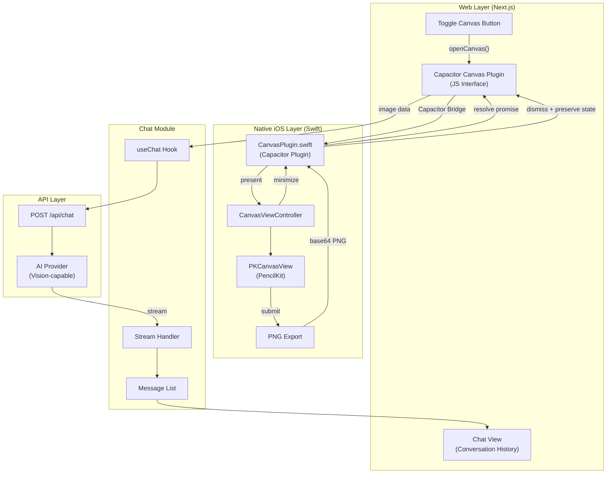

# Design Document

## Overview

Chatty Pencil transforms the existing Next.js chat application into a handwriting-first experience for iPad. The core interaction model replaces keyboard input with a native iOS canvas powered by PencilKit, accessed via a Capacitor plugin. When the user taps "Toggle Canvas", a native Swift view controller presents a fullscreen drawing canvas with full Apple Pencil support. Upon submission, the native layer converts the drawing to PNG and returns it to the JavaScript layer for sending to the AI.

The architecture leverages the existing `@ai-sdk/react` chat infrastructure while delegating all drawing functionality to native iOS via a custom Capacitor plugin. This approach provides optimal Apple Pencil performance, pressure sensitivity (future), and native iOS drawing UX.

## Architecture



## Components and Interfaces

### Capacitor Plugin Interface (JavaScript)

```typescript
// lib/canvas-plugin.ts
export interface CanvasPlugin {
  /**
   * Opens the native fullscreen canvas for drawing.
   * Returns when user submits (with image) or minimizes (without image).
   */
  openCanvas(options?: OpenCanvasOptions): Promise<CanvasResult>;
  
  /**
   * Clears the preserved canvas state (called on new conversation).
   */
  clearCanvas(): Promise<void>;
  
  /**
   * Checks if there's unsaved content on the canvas.
   */
  hasContent(): Promise<{ hasContent: boolean }>;
}

export interface OpenCanvasOptions {
  /** Background color for the canvas (default: white) */
  backgroundColor?: string;
}

export interface CanvasResult {
  /** Action taken by user */
  action: 'submitted' | 'minimized' | 'cancelled';
  /** Base64 PNG image data (only present if action is 'submitted') */
  imageData?: string;
  /** Whether canvas has content (for minimize case) */
  hasContent: boolean;
}

// Register with Capacitor
import { registerPlugin } from '@capacitor/core';
export const Canvas = registerPlugin<CanvasPlugin>('Canvas');
```

### Native Plugin Interface (Swift)

```swift
// ios/App/App/Plugins/CanvasPlugin.swift
import Capacitor
import PencilKit

@objc(CanvasPlugin)
public class CanvasPlugin: CAPPlugin {
    
    private var canvasViewController: CanvasViewController?
    private var currentCall: CAPPluginCall?
    
    @objc func openCanvas(_ call: CAPPluginCall) {
        // Present native canvas view controller
    }
    
    @objc func clearCanvas(_ call: CAPPluginCall) {
        // Clear preserved drawing state
    }
    
    @objc func hasContent(_ call: CAPPluginCall) {
        // Check if canvas has strokes
    }
}
```

### Native Canvas View Controller (Swift)

```swift
// ios/App/App/Plugins/CanvasViewController.swift
import UIKit
import PencilKit

class CanvasViewController: UIViewController {
    
    private let canvasView = PKCanvasView()
    private var toolPicker: PKToolPicker?
    
    // Delegate for communicating back to plugin
    weak var delegate: CanvasViewControllerDelegate?
    
    // Preserved drawing for minimize/reopen
    private static var preservedDrawing: PKDrawing?
    
    func submit() {
        // Export to PNG and call delegate
    }
    
    func minimize() {
        // Preserve drawing and dismiss
    }
    
    func clear() {
        // Clear canvas
    }
}

protocol CanvasViewControllerDelegate: AnyObject {
    func canvasDidSubmit(imageData: String)
    func canvasDidMinimize(hasContent: Bool)
    func canvasDidCancel()
}
```

### Chat Integration (TypeScript)

```typescript
// Hook for canvas integration
interface UseCanvasPluginReturn {
  openCanvas: () => Promise<void>;
  hasUnsavedContent: boolean;
  isCanvasOpen: boolean;
}

function useCanvasPlugin(
  onSubmit: (imageData: string) => void
): UseCanvasPluginReturn;
```

### UI Components (React)

```typescript
// Toggle button in chat view
interface ToggleCanvasButtonProps {
  onClick: () => void;
  hasUnsavedContent: boolean;
  disabled?: boolean;
}
```

## Data Models

### Native Drawing State (Swift)

```swift
// Drawing state is managed natively by PencilKit
// PKDrawing is preserved as a static property for minimize/reopen
// No need to serialize strokes to JavaScript - only PNG export matters
```

### Message with Canvas Image (TypeScript)

```typescript
// User message containing canvas submission
interface CanvasUserMessage {
  role: 'user';
  content: string; // "Sent handwritten message"
  experimental_attachments: Array<{
    name: string;
    contentType: 'image/png';
    url: string; // data:image/png;base64,...
  }>;
}
```

### Plugin Communication

```typescript
// Result from native canvas
interface CanvasResult {
  action: 'submitted' | 'minimized' | 'cancelled';
  imageData?: string;  // Base64 PNG, only on submit
  hasContent: boolean; // Whether canvas has strokes
}
```


## Correctness Properties

*A property is a characteristic or behavior that should hold true across all valid executions of a system-essentially, a formal statement about what the system should do. Properties serve as the bridge between human-readable specifications and machine-verifiable correctness guarantees.*

Note: Properties 1-3 relate to native PencilKit behavior which is handled by iOS. We focus on testable properties at the JavaScript/plugin boundary.

### Property 1: Export produces valid base64 PNG when canvas has content

*For any* canvas submission where hasContent is true, the returned imageData SHALL be a string that starts with "data:image/png;base64," and contains valid base64-encoded data that decodes to a valid PNG image.

**Validates: Requirements 2.1**

### Property 2: Submit clears preserved canvas state

*For any* canvas with content, after a successful submit (action === 'submitted'), calling hasContent() SHALL return false.

**Validates: Requirements 2.2**

### Property 3: Empty canvas prevents submission with image

*For any* canvas with no content, the submit action SHALL either be disabled or return action === 'cancelled' without imageData.

**Validates: Requirements 2.3**

### Property 4: Submitted image appears in messages

*For any* canvas submission with valid imageData, the resulting message in the conversation SHALL contain the image data as an attachment with contentType 'image/png'.

**Validates: Requirements 2.4, 2.5**

### Property 5: Clear removes all canvas content

*For any* canvas state, after calling clearCanvas(), hasContent() SHALL return false.

**Validates: Requirements 3.1**

### Property 6: Auto-scroll on new message

*For any* conversation where a new message is added and the user has not manually scrolled away from the bottom, the scroll position SHALL move to show the latest message.

**Validates: Requirements 5.2**

### Property 7: Manual scroll pauses auto-scroll

*For any* conversation where the user manually scrolls up (away from bottom), subsequent new messages SHALL NOT trigger auto-scroll until the user scrolls back to the bottom.

**Validates: Requirements 5.3**

### Property 8: Toggle button opens native canvas

*For any* state where the canvas is not open, calling openCanvas() SHALL present the native canvas view controller.

**Validates: Requirements 6.2**

### Property 9: Minimize/reopen preserves drawing (round-trip)

*For any* canvas with content, minimizing (action === 'minimized') and then reopening SHALL restore the same drawing, verified by hasContent() returning true.

**Validates: Requirements 6.5, 6.6**

### Property 10: Submit closes canvas and returns to chat

*For any* successful canvas submission (action === 'submitted'), the native canvas SHALL be dismissed and control SHALL return to the web view.

**Validates: Requirements 6.7**

### Property 11: New conversation resets all state

*For any* state with messages and/or canvas content, starting a new conversation SHALL result in an empty messages array AND hasContent() returning false.

**Validates: Requirements 7.1, 7.2**

## Error Handling

### Native Plugin Errors

| Error Condition | Handling Strategy |
|----------------|-------------------|
| Plugin not available (web) | Show message that canvas requires iPad app |
| PencilKit unavailable | Display error, suggest iOS update |
| Image export fails | Return error to JS, show toast notification |
| View controller presentation fails | Reject promise with error details |

### API Errors

| Error Condition | Handling Strategy |
|----------------|-------------------|
| Network failure | Display error in chat, allow retry |
| AI provider error | Show error message with details |
| Image too large | Compress image in native layer before export |
| Rate limiting | Queue message, show pending state |

### Bridge Communication Errors

| Error Condition | Handling Strategy |
|----------------|-------------------|
| Promise timeout | Reject after 30s, allow retry |
| Invalid base64 data | Log error, show submission failed message |
| Plugin call rejected | Display user-friendly error message |

## Testing Strategy

### Property-Based Testing Library

This project will use **fast-check** for property-based testing in TypeScript/JavaScript.

```bash
npm install --save-dev fast-check @testing-library/react vitest
```

### Property-Based Tests

Each correctness property will be implemented as a property-based test using fast-check. Tests will:
- Run a minimum of 100 iterations per property
- Use smart generators that constrain inputs to valid image data and message structures
- Be tagged with comments referencing the design document property
- Mock the Capacitor plugin for JavaScript-side testing

Example test structure:
```typescript
// **Feature: handwriting-canvas, Property 1: Export produces valid base64 PNG when canvas has content**
// **Validates: Requirements 2.1**
test('submitted image data is valid base64 PNG', () => {
  fc.assert(
    fc.property(
      fc.base64String({ minLength: 100 }),
      (randomBase64) => {
        const imageData = `data:image/png;base64,${randomBase64}`;
        expect(imageData).toMatch(/^data:image\/png;base64,/);
        // Verify base64 is decodable
        expect(() => atob(randomBase64)).not.toThrow();
      }
    ),
    { numRuns: 100 }
  );
});
```

### Native Testing (Swift)

Native canvas functionality will be tested using XCTest:
- PKCanvasView drawing state management
- PNG export from PKDrawing
- View controller presentation/dismissal
- Plugin bridge communication

### Unit Tests (TypeScript)

Unit tests will cover:
- Canvas plugin wrapper functions
- Toggle button component states
- Message rendering with image attachments
- useCanvasPlugin hook behavior

### Integration Tests

Integration tests will verify:
- Full submission flow (open canvas → submit → message appears in chat)
- Canvas state preservation across minimize/reopen
- New conversation reset behavior
- Error handling when plugin unavailable

### Test File Organization

```
__tests__/
├── lib/
│   ├── canvas-plugin.test.ts      # Plugin wrapper tests
│   └── canvas-plugin.property.ts  # Property-based tests
├── components/
│   ├── ToggleCanvasButton.test.tsx
│   └── ChatWithCanvas.test.tsx
├── hooks/
│   └── useCanvasPlugin.test.ts
└── integration/
    └── canvasSubmission.test.tsx

ios/App/AppTests/
├── CanvasPluginTests.swift
├── CanvasViewControllerTests.swift
└── ImageExportTests.swift
```
