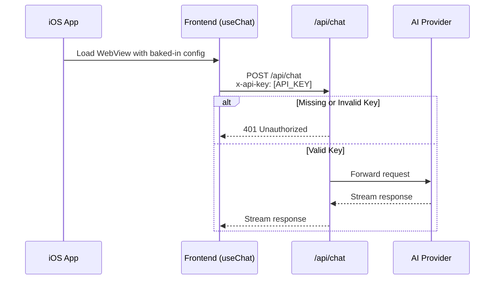

# Design Document

## Overview

This design implements simple API key authentication for the production deployment of the Chatty Pencil iOS app. The solution involves:
1. Adding API key validation middleware to the `/api/chat` route
2. Configuring the iOS app with the production URL and API key via Capacitor config
3. Modifying the frontend to include the API key header in all requests
4. Creating environment variable documentation

## Architecture



## Components and Interfaces

### 1. API Key Validation (Server-side)

Location: `app/api/chat/route.ts`

```typescript
// Validate API key from request headers
function validateApiKey(request: Request): boolean {
  const apiKey = request.headers.get('x-api-key');
  const expectedKey = process.env.API_SECRET_KEY;
  
  if (!expectedKey || !apiKey) {
    return false;
  }
  
  // Simple string comparison (sufficient for beta)
  return apiKey === expectedKey;
}
```

### 2. Frontend Configuration

Location: `app/page.tsx`

The `useChat` hook will be configured to include the API key header:

```typescript
const { messages, sendMessage, status, regenerate, setMessages } = useChat({
  headers: {
    'x-api-key': process.env.NEXT_PUBLIC_API_KEY || '',
  },
});
```

### 3. Capacitor Configuration

Location: `capacitor.config.ts`

**Development** (current): Loads web content from a remote dev server URL.

**Production**: Bundles static files into the iOS app and only makes API calls to the production backend.

```typescript
import type { CapacitorConfig } from '@capacitor/cli';

const isDev = process.env.NODE_ENV === 'development';

const config: CapacitorConfig = {
  appId: 'ai.humanintent.ios.chattypencil',
  appName: 'Chatty Pencil',
  webDir: 'out',
  // Only use server.url in development for hot reload
  // In production, static files are bundled in the app
  ...(isDev && {
    server: {
      url: 'http://192.168.100.129:3000',
      cleartext: true
    }
  })
};

export default config;
```

### 4. API Base URL Configuration

Since production builds bundle static files, the frontend needs to know where to send API requests.

Location: `lib/api-config.ts` (new file)

```typescript
// API base URL - empty string for same-origin (dev), full URL for production
export const API_BASE_URL = process.env.NEXT_PUBLIC_API_URL || '';

// API key for authentication
export const API_KEY = process.env.NEXT_PUBLIC_API_KEY || '';
```

The frontend will use `API_BASE_URL` to construct the full API endpoint URL when making requests.

### 5. Environment Variables

| Variable | Location | Purpose |
|----------|----------|---------|
| `PROVIDER_API_KEY` | Server | AI provider authentication |
| `API_SECRET_KEY` | Server | API route protection |
| `NEXT_PUBLIC_API_KEY` | Client (build-time) | Sent in request headers |
| `NEXT_PUBLIC_API_URL` | Client (build-time) | Production API base URL (e.g., `https://api.example.com`) |

## Data Models

No new data models required. The feature only adds header-based authentication.

## Correctness Properties

*A property is a characteristic or behavior that should hold true across all valid executions of a system-essentially, a formal statement about what the system should do. Properties serve as the bridge between human-readable specifications and machine-verifiable correctness guarantees.*

Based on the prework analysis, the following properties can be tested:

### Property 1: Missing API key returns 401

*For any* request to the Chat_API without an `x-api-key` header, the API SHALL return a 401 status code.

**Validates: Requirements 1.1**

### Property 2: Invalid API key returns 401

*For any* request to the Chat_API with an `x-api-key` header containing a value different from `API_SECRET_KEY`, the API SHALL return a 401 status code.

**Validates: Requirements 1.2**

## Error Handling

| Scenario | Response |
|----------|----------|
| Missing `x-api-key` header | 401 Unauthorized with `{ error: 'Unauthorized' }` |
| Invalid API key | 401 Unauthorized with `{ error: 'Unauthorized' }` |
| Missing `API_SECRET_KEY` env var | 401 Unauthorized (fail closed) |

The error response is intentionally generic to avoid leaking information about whether the key was missing or incorrect.

## Testing Strategy

### Unit Tests

- Test `validateApiKey` function with valid key
- Test `validateApiKey` function with invalid key
- Test `validateApiKey` function with missing key
- Test `validateApiKey` function with missing env var

### Property-Based Tests

Using a property-based testing library (e.g., fast-check):

1. **Property 1**: Generate random requests without `x-api-key` header → all return 401
2. **Property 2**: Generate random invalid API keys → all return 401

Each property test should run a minimum of 100 iterations.

Test annotations format: `**Feature: production-deployment, Property {number}: {property_text}**`
