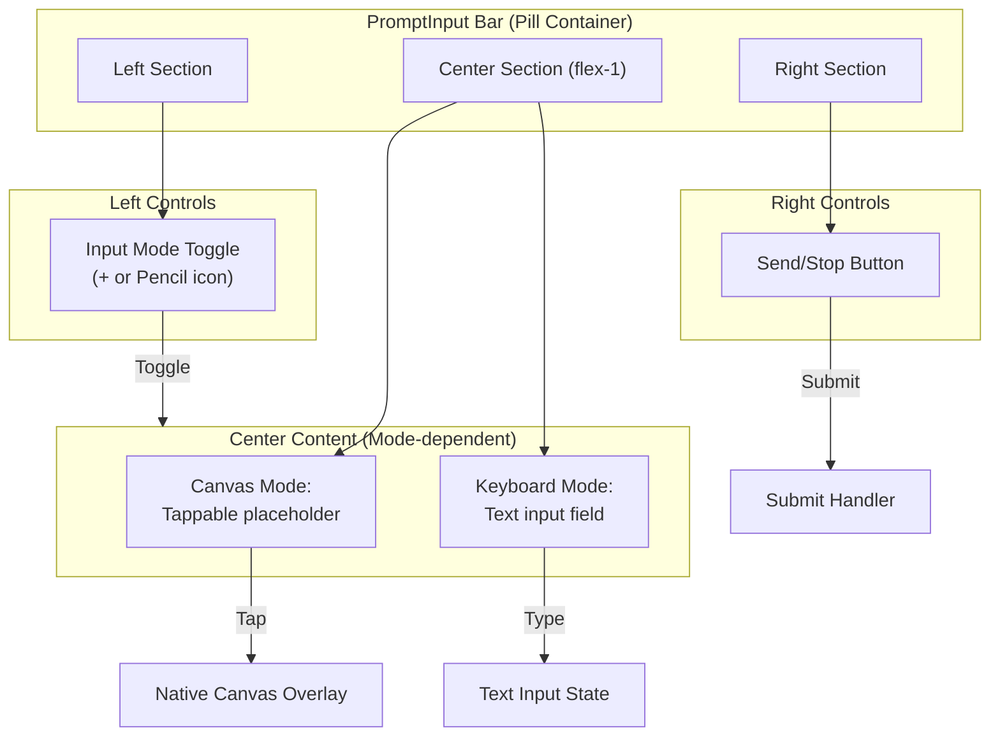

# Design Document

## Overview

This feature reworks the PromptInput component to provide a cleaner, more minimal input bar design inspired by modern chat interfaces like Google's search/chat input. The new layout uses a horizontal three-section design: left (input mode toggle), center (main input area), and right (send/stop button). The design leverages existing ai-elements components while introducing a new layout structure and visual styling.

## Architecture



## Components and Interfaces

### MinimalPromptInput Component

The main wrapper component that provides the new pill-shaped layout:

```typescript
interface MinimalPromptInputProps {
  inputMode: 'canvas' | 'keyboard';
  onInputModeChange: (mode: 'canvas' | 'keyboard') => void;
  onOpenCanvas: () => void;
  hasUnsavedContent: boolean;
  isCanvasOpen: boolean;
  onSubmit: (message: PromptInputMessage) => void;
  status?: ChatStatus;
  input: string;
  onInputChange: (value: string) => void;
}
```

### Layout Structure

The input bar uses a flex container with three sections:

```tsx
<div className="flex items-center gap-2 rounded-full border bg-background px-2 py-1.5">
  {/* Left: Toggle Button */}
  <Button variant="ghost" size="icon" className="shrink-0 rounded-full">
    {inputMode === 'canvas' ? <PlusIcon /> : <PenToolIcon />}
  </Button>
  
  {/* Center: Input Area (flex-1) */}
  <div className="flex-1 min-w-0">
    {inputMode === 'canvas' ? (
      <CanvasPlaceholder onClick={onOpenCanvas} hasContent={hasUnsavedContent} />
    ) : (
      <TextInput value={input} onChange={onInputChange} />
    )}
  </div>
  
  {/* Right: Send/Stop Button */}
  <Button variant="default" size="icon" className="shrink-0 rounded-full">
    {status === 'streaming' ? <SquareIcon /> : <SendIcon />}
  </Button>
</div>
```

### CanvasPlaceholder Component

A tappable area that opens the canvas:

```typescript
interface CanvasPlaceholderProps {
  onClick: () => void;
  hasContent: boolean;
  disabled?: boolean;
  placeholder?: string;
}
```

### Integration with Existing Components

The new layout integrates with existing ai-elements:
- Uses `PromptInput` as the form wrapper for submission handling
- Uses `PromptInputTextarea` for keyboard mode (styled inline)
- Uses `PromptInputSubmit` logic for send/stop button states
- Preserves attachment handling via `PromptInputAttachments`

## Data Models

### Input Mode State

```typescript
type InputMode = 'canvas' | 'keyboard';

interface InputBarState {
  mode: InputMode;
  textInput: string;
  hasUnsavedCanvasContent: boolean;
  isCanvasOpen: boolean;
}
```

### Submit Payload

The submit payload remains compatible with existing `PromptInputMessage`:

```typescript
interface PromptInputMessage {
  text: string;
  files: FileUIPart[];
}
```

## Correctness Properties

*A property is a characteristic or behavior that should hold true across all valid executions of a system-essentially, a formal statement about what the system should do. Properties serve as the bridge between human-readable specifications and machine-verifiable correctness guarantees.*

### Property 1: Three-section layout structure

*For any* rendered input bar, the container SHALL have exactly three direct child sections: left controls, center input area, and right controls, in that order.

**Validates: Requirements 1.1, 1.2, 1.3, 1.4**

### Property 2: Input mode toggle changes mode

*For any* input mode state (canvas or keyboard), clicking the toggle button SHALL result in the opposite mode being active.

**Validates: Requirements 2.1**

### Property 3: Icon reflects current mode

*For any* input mode, the toggle button SHALL display a "+" icon when in canvas mode and a pencil icon when in keyboard mode.

**Validates: Requirements 2.2, 2.3**

### Property 4: Canvas content preserved across mode switches

*For any* state with unsaved canvas content, switching from canvas mode to keyboard mode and back SHALL preserve the hasUnsavedContent state as true.

**Validates: Requirements 2.4**

### Property 5: Center area content matches mode

*For any* input mode, the center area SHALL display a tappable canvas placeholder when in canvas mode and a text input field when in keyboard mode.

**Validates: Requirements 3.1, 3.2**

### Property 6: Unsaved content indicator visibility

*For any* state where hasUnsavedContent is true, the center area (in canvas mode) SHALL display a visual indicator of unsaved content.

**Validates: Requirements 3.3**

### Property 7: Send button state reflects content availability

*For any* state, the send button SHALL be enabled if and only if there is content to send (non-empty text in keyboard mode, or unsaved canvas content in canvas mode).

**Validates: Requirements 4.1, 4.2**

### Property 8: Touch targets meet minimum size

*For any* interactive element in the input bar (toggle button, center tappable area, send button), the element SHALL have a minimum touch target size of 44x44 points.

**Validates: Requirements 5.3**

## Error Handling

| Error Condition | Handling Strategy |
|----------------|-------------------|
| Canvas plugin unavailable | Disable canvas mode, show keyboard-only input |
| Submit with empty content | Prevent submission, keep button disabled |
| Mode switch during streaming | Allow mode switch, preserve streaming state |
| Canvas open fails | Show error toast, remain in canvas mode |

## Testing Strategy

### Property-Based Testing Library

This project uses **fast-check** for property-based testing in TypeScript/JavaScript, along with **@testing-library/react** for component testing.

### Property-Based Tests

Each correctness property will be implemented as a property-based test:
- Run a minimum of 100 iterations per property
- Use generators for input mode states and content states
- Tag tests with comments referencing design document properties

### Unit Tests

Unit tests will cover:
- Toggle button click handler
- Mode-dependent rendering
- Send button state logic
- Canvas placeholder click handler

### Test File Organization

```
components/__tests__/
├── MinimalPromptInput.test.tsx      # Component tests
└── MinimalPromptInput.property.ts   # Property-based tests
```
